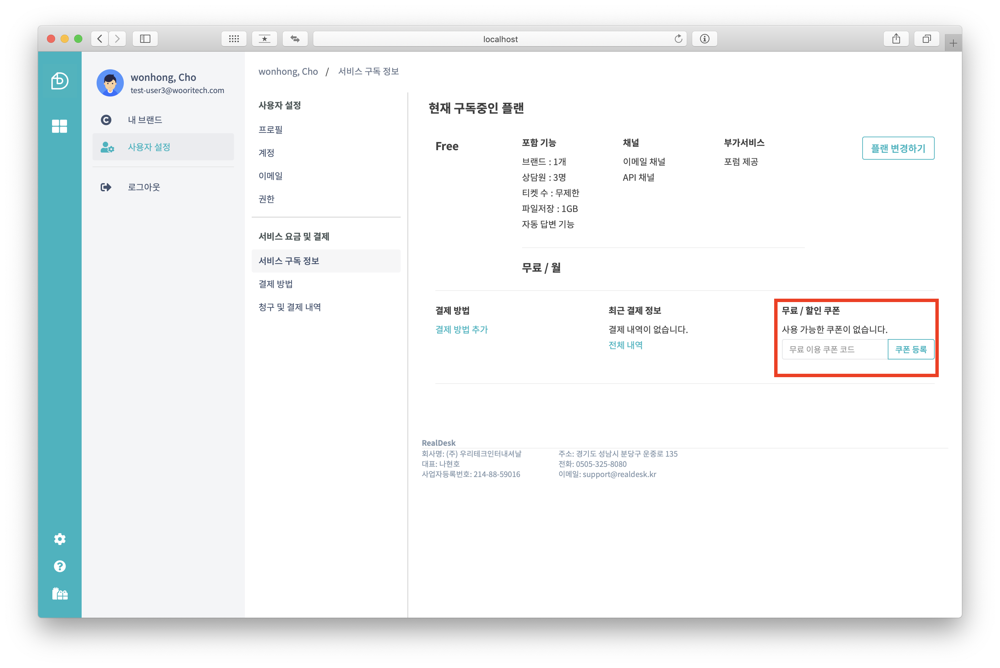
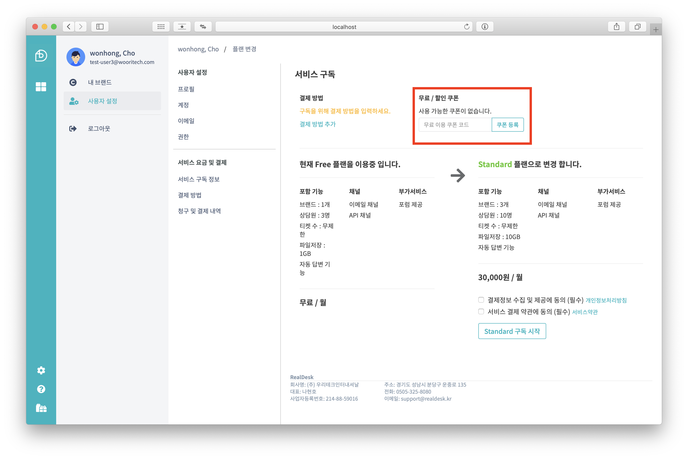
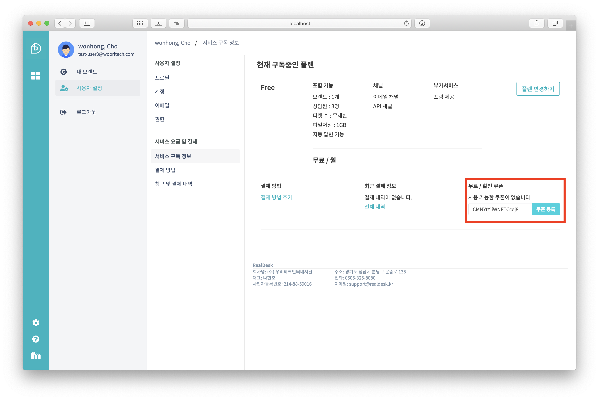
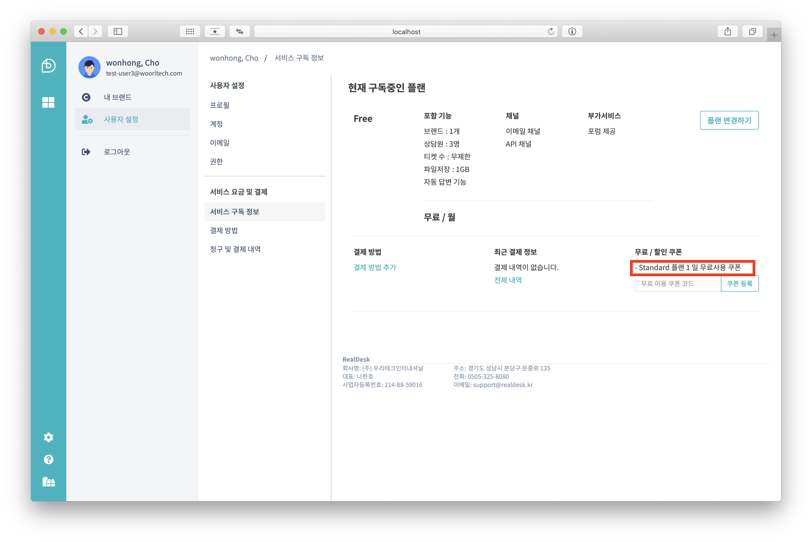
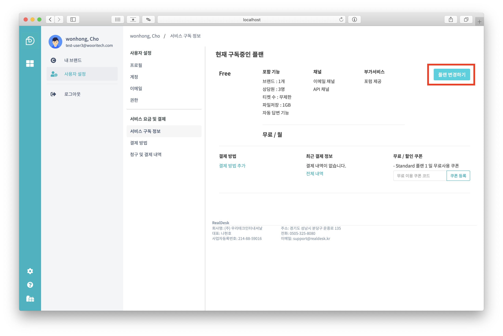
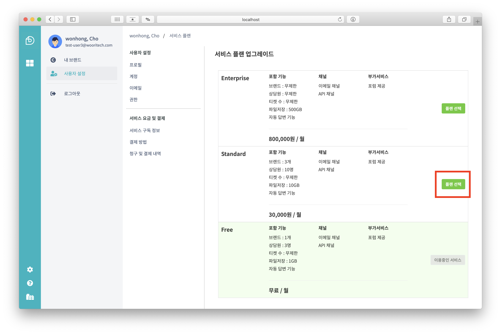
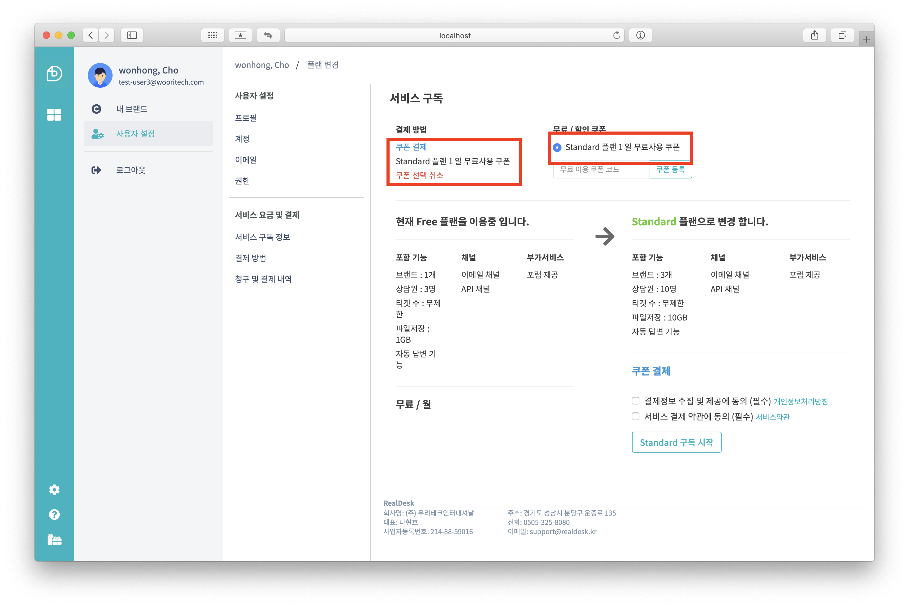
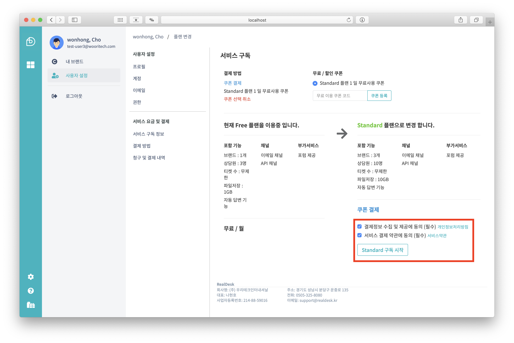
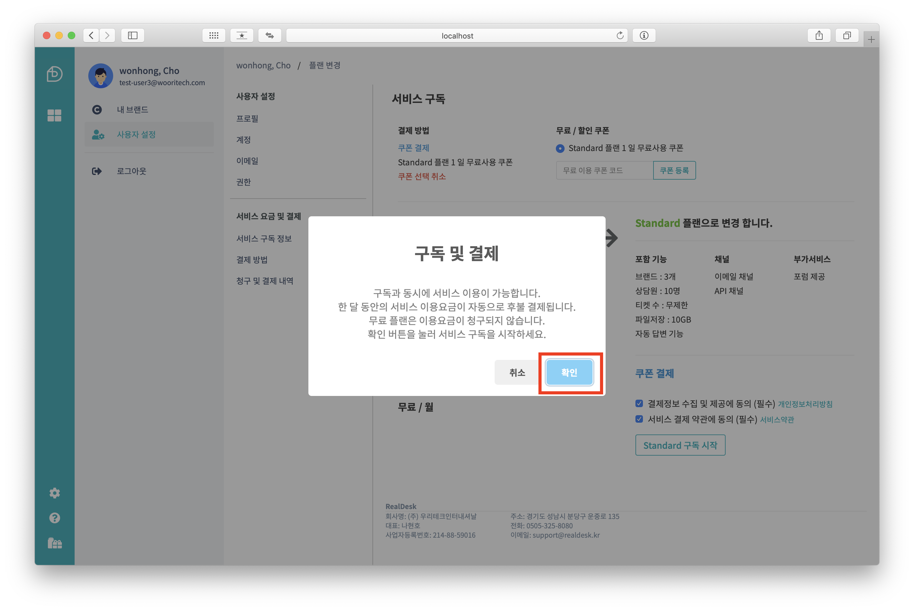
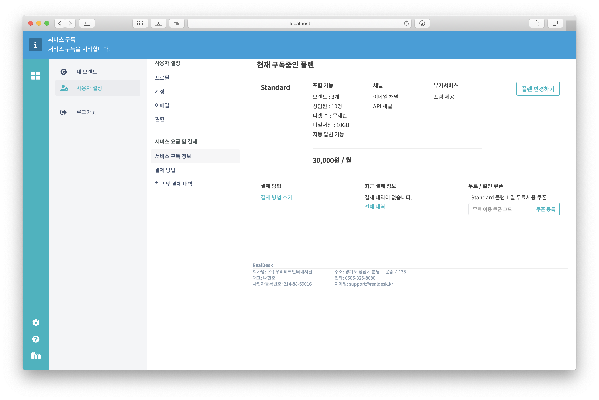

# 쿠폰 사용하기

::: tip
**RealDesk** 무료 쿠폰은 [sales@realdesk.kr](mailto://sales@realdesk.kr)로 문의하세요.
:::

## 쿠폰 등록하기

무료 쿠폰 및 할인 쿠폰은 서비스 구독 화면과 플랜 변경 화면에서 등록할 수 있습니다.

발급 받은 쿠폰 코드를 `쿠폰 코드 입력창`에 입력 하고 **쿠폰 등록** 버튼을 클릭합니다.

등록된 쿠폰은 **무료 / 할인 쿠폰** 에 표시됩니다.

이제 등록된 무료 쿠폰을 사용해 보겠습니다.

## 쿠폰으로 플랜 업그레이드하기

등록된 쿠폰을 사용하여 플랜을 업그레이드 해보겠습니다.

위의 예에서 발급 받은 쿠폰은 **Standard 플랜**을 1일 동안 사용할 수 있는 무료 사용 쿠폰 입니다. 이 쿠폰을 등록하기 위해 `서비싀 구독 정보` 화면에서 **플랜 변경하기** 버튼을 클릭 합니다.

발급 받은 쿠폰이 **Standard 플랜** 에 사용할 수 있는 쿠폰이므로 변경할 플랜 목록에서 **Standard**의 **플랜 선택** 버튼을 클릭합니다.

이제, 플랜 변경화면에서 쿠폰을 선택해 보겠습니다. 쿠폰 목록에 표시된 쿠폰중 업그레이드할 플랜에 사용가능한 쿠폰을 선택합니다.

::: warning
다른 플랜의 쿠폰을 선택하면 구독을 업그레이드할 수 없습니다.
:::

플랜을 구독하기 위해 **결제정보 수집 및 제공에 동의** 와 **서비스 결제 약관에 동의** 에 체크한 다음 **구독 시작** 버튼을 클릭합니다.

**구독 및 결제** 확인창이 나타나면 **확인** 버튼을 눌러 변경 내용을 확인 합니다.

무료 쿠폰을 이용한 결제가 완료되면 해당 플랜을 주어진 기간 동안 무료로 사용할 수 있습니다.

