# 빠르게 시작하기

> 본 가이드는 RealDesk를 처음 시작하는 사용자가 개인 또는 회사 브랜드의 고객 지원을 빠르게 시작할 수 있도록 구성된 도움말입니다. 본 가이드를 통해 단 몇 분 만에 이메일을 통한 고객 요청에 응답할 수 있는 시스템을 구축할 수 있습니다. 순서대로 따라해 보시면 분명 RealDesk의 작동방식을 이해하는데 도움이 될것입니다.

## 1. 사용자 등록

RealDesk의 [사용자 등록 화면](http://realdesk.kr/join)에서 이메일 주소를 이용해 **사용자 등록** 합니다.

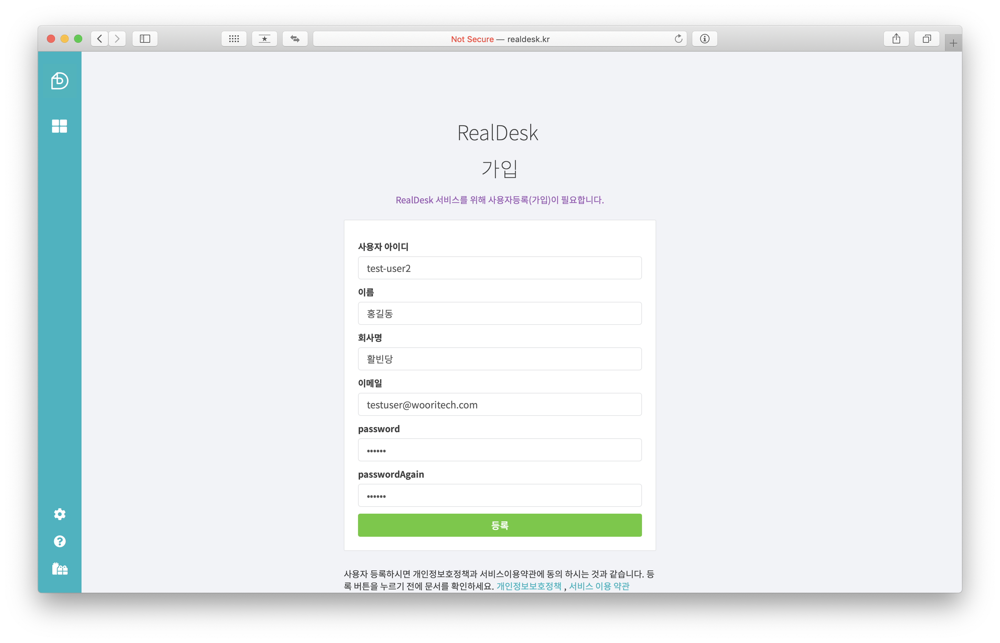

## 2. 로그인

가입한 사용자 아이디 또는 이메일 주소를 이용해 로그인합니다.

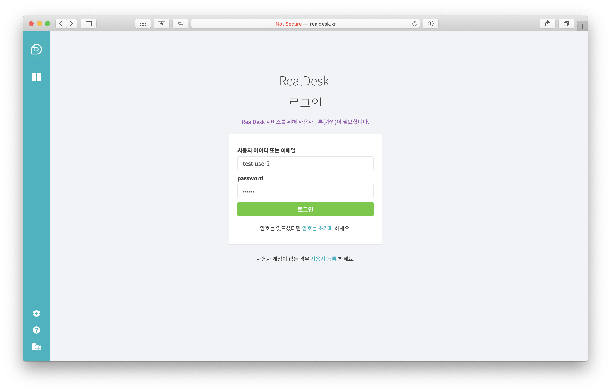

## 3. 브랜드 만들기

개인 또는 회사가 가진 브랜드나 제품의 고객 지원을 위해 새로운 브랜드를 만들어 보겠습니다.

위 [로그인](http://realdesk.kr/signin) 화면에서 로그인 한 다음 **내브랜드** 버튼을 클릭합니다.

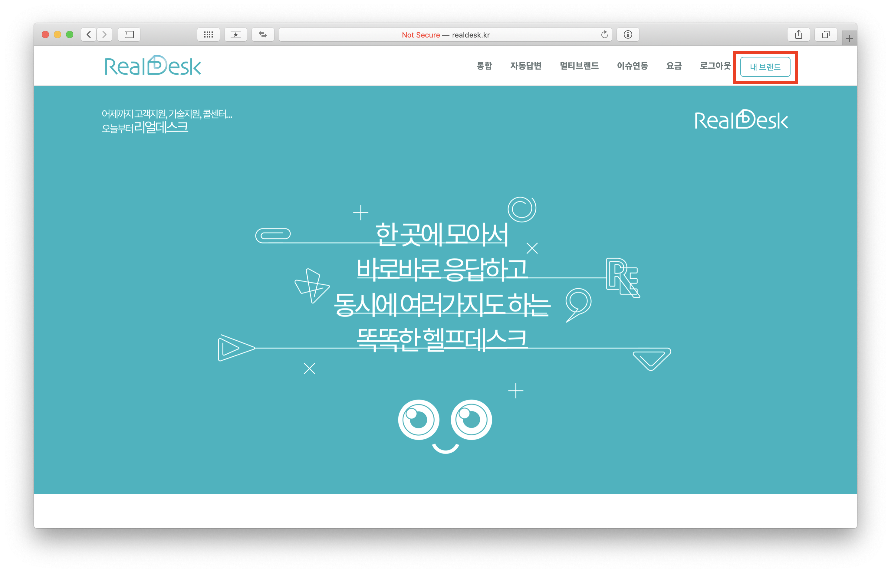

[내 브랜드](http://realdesk.kr/brands) 화면에서 **New Brand** 버튼을 클릭합니다.

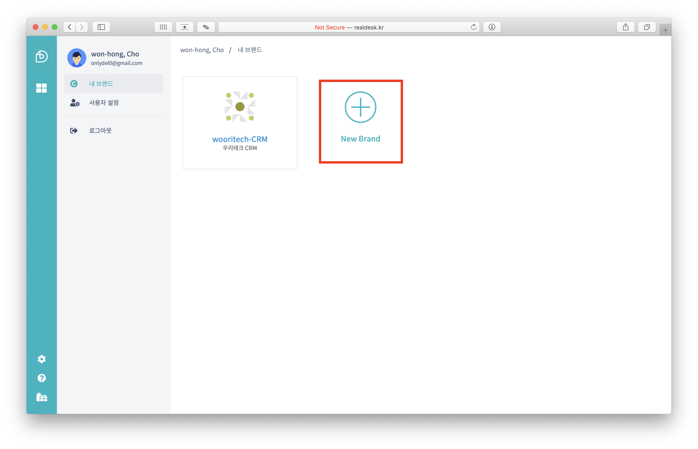

[새 브랜드 만들기](http://realdesk.kr/brands/new) 화면에서 `브랜드 이름`, `브랜드 표시명`, `브랜드 설명`을 입력하고 **저장** 버튼을 클릭합니다. 본 가이드에서는 설명을 위해 `브랜드 이름`에 **wooritech-CRM** 라는 가상의 제품명을 입력해 보겠습니다.

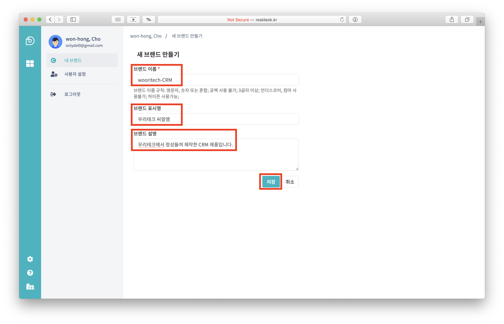

## 4. 고객 지원용 이메일 계정 만들기

이제 **wooritech-CRM** 제품 사용자들로부터 제품에 대한 문의사항이나 개선 요청사항을 받기위한 이메일 주소를 설정해 보겠습니다.

정상적으로 새로운 브랜드가 만들어졌다면 아래 화면처럼 **브랜드** 버튼을 볼수 있습니다. 이 **브랜드** 버튼을 클릭합니다.

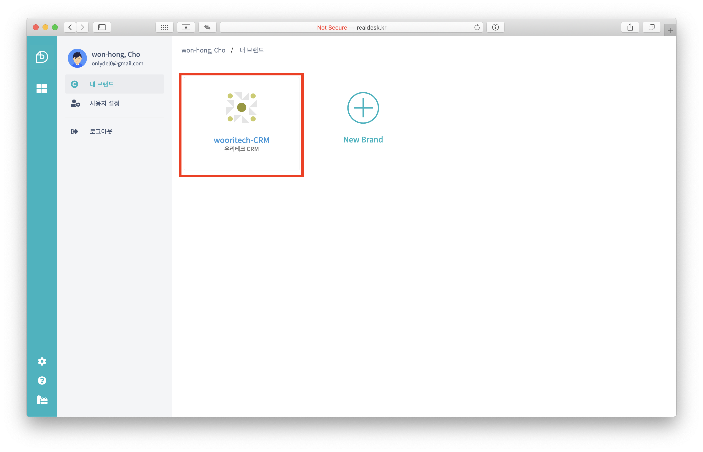

**브랜드 설정** 화면에서 **지원이메일** 메뉴를 클릭합니다.

고객 지원용 이메일 계정은 RealDesk에서 기본제공 되는 `@realdesk.kr` 주소를 이용할 수도 있고, 사용자 이메일 주소를 이용할 수도 있습니다. 본 가이드에서는 빠른 테스트를 위해 `wooritechCRM@realdesk.kr` 이라는 주소를 사용해 보겠습니다.

`발신자명`에 `기술지원`을 입력하고 `이메일 계정명`에 `wooritechCRM`을 입력한 다음 **+** 버튼을 클릭 합니다.

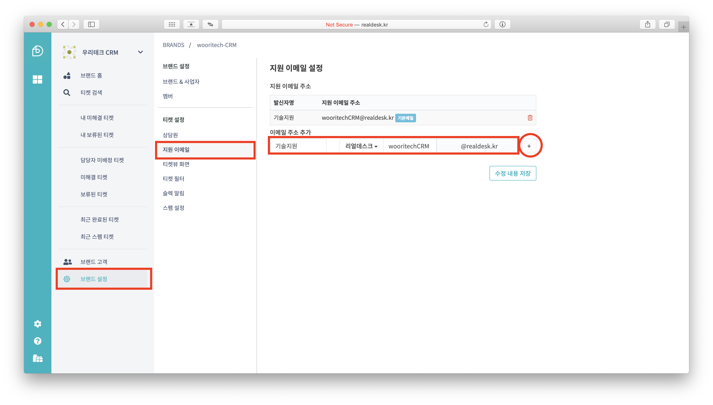

**수정내용저장** 버튼을 눌러 기술지원 이메일 설정을 저장합니다.

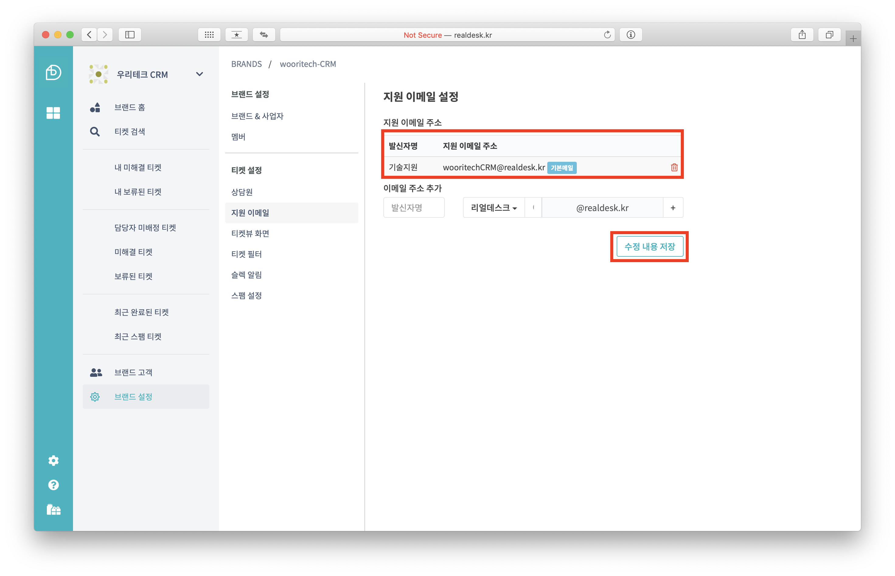

이제 우리는 `wooritech-CRM` 제품에 대한 고객의 기술지원 요청을 받을 준비가 모두 끝났습니다.

## 5. 고객의 새로운 요청 테스트

이번에는 고객이 위에서 만든 고객 지원용 이메일 주소(여기서는 `wooritechCRM@realdesk.kr`)로 도움 요청 메일을 보냈을때 RealDesk에 티켓이 만들어 지는지 확인해 보도록 하겠습니다.

아래와 같은 메일을 작성해서 지원용 이메일 주소로 메일을 보냅니다.

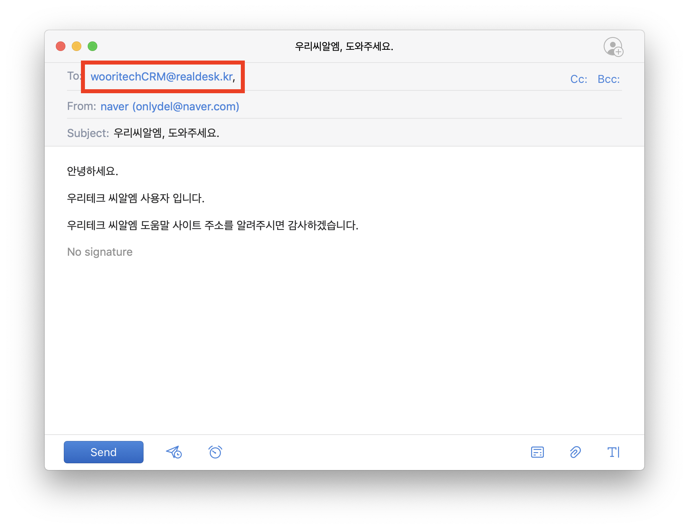

알 수 없는 고객이 이메일을 통해 도움을 요청하면 아래와 같은 일들이 RealDesk에서 일어납니다.

1. 요청을 보낸 고객의 이메일 주소를 이용해 새로운 고객을 추가합니다.
2. 이메일 내용을 기반으로 새로운 티켓을 생성합니다.

이제 RealDesk의 티켓 필터를 통해 티켓을 확인해 보겠습니다. 새로운 티켓이 발급되면 **미해결 티켓** 이라는 티켓 필터 목록에서 조회할 수 있습니다.

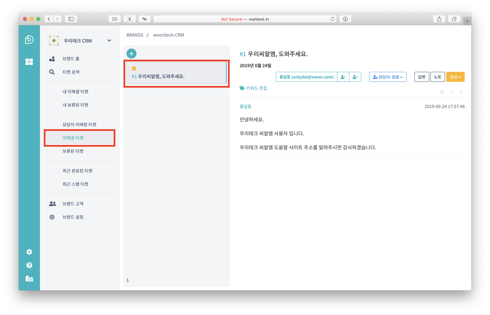

## 6. 상담원의 답변 테스트

상담원이 고객의 요청을 확인했다면 답변을 해야 합니다. 본 가이드에서 상담원 답변은 아래와 같은 순서로 진행합니다.

1. 상담원은 **티켓뷰** 화면에서 **답변** 버튼을 클릭합니다.
2. 입력칸에 답변을 입력합니다.
3. **신슈 상태로 저장** 버튼 옆에 있는 드롭다운 버튼을 눌러 상태 저장 목록을 표시합니다.
4. **완료 상태로 저장** 메뉴를 클릭합니다.

이렇게 하면 해당 티켓의 답변을 전송함과 동시에 티켓의 상태가 **완료**로 바뀌게 됩니다.

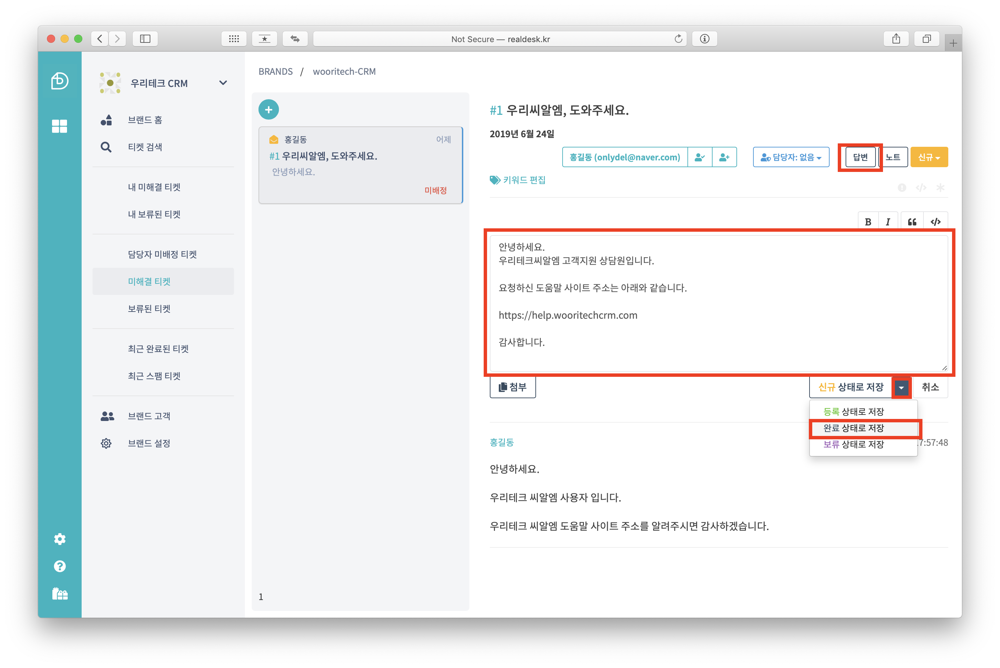

상태가 **완료**인 티켓은 더 이상 **미해결 티켓** 목록에서 조회되지 않습니다.

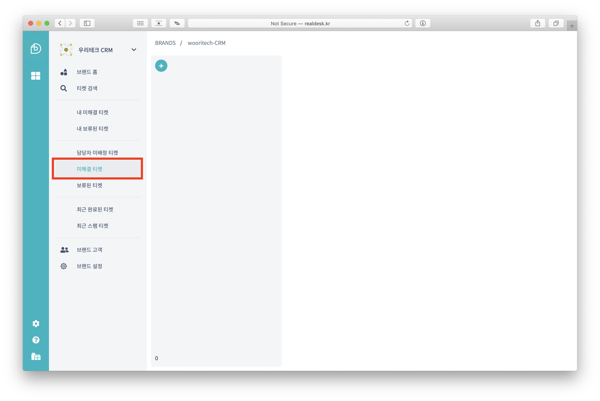

**완료** 상태의 티켓은 **최근 완료된 티켓**에서 확인할 수 있습니다. 또, 고객의 요청에 최초 답변한 상담원이 해당 티켓의 담당자로 자동 배정되는 것도 확인할 수 있습니다.

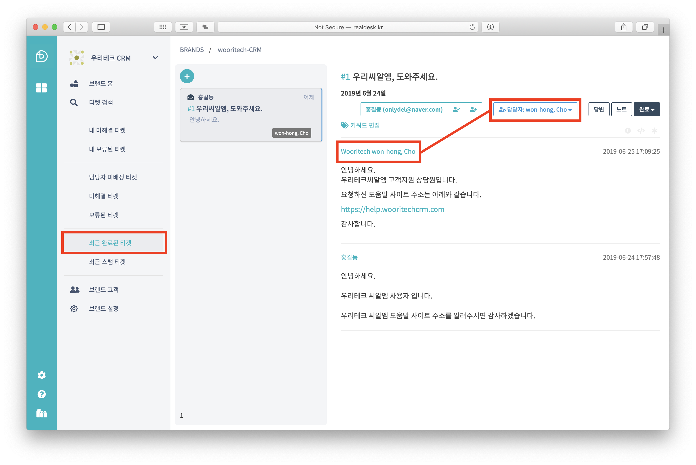

## 7. 고객의 메일로 전송된 답변

상담원이 티켓에 답변을 기록하면 요청 고객의 이메일로 답변이 자동 발송 됩니다. 이메일 클라이언트에서 메일을 열어 확인하면 보통 아래화면과 비슷한 화면을 보게됩니다.

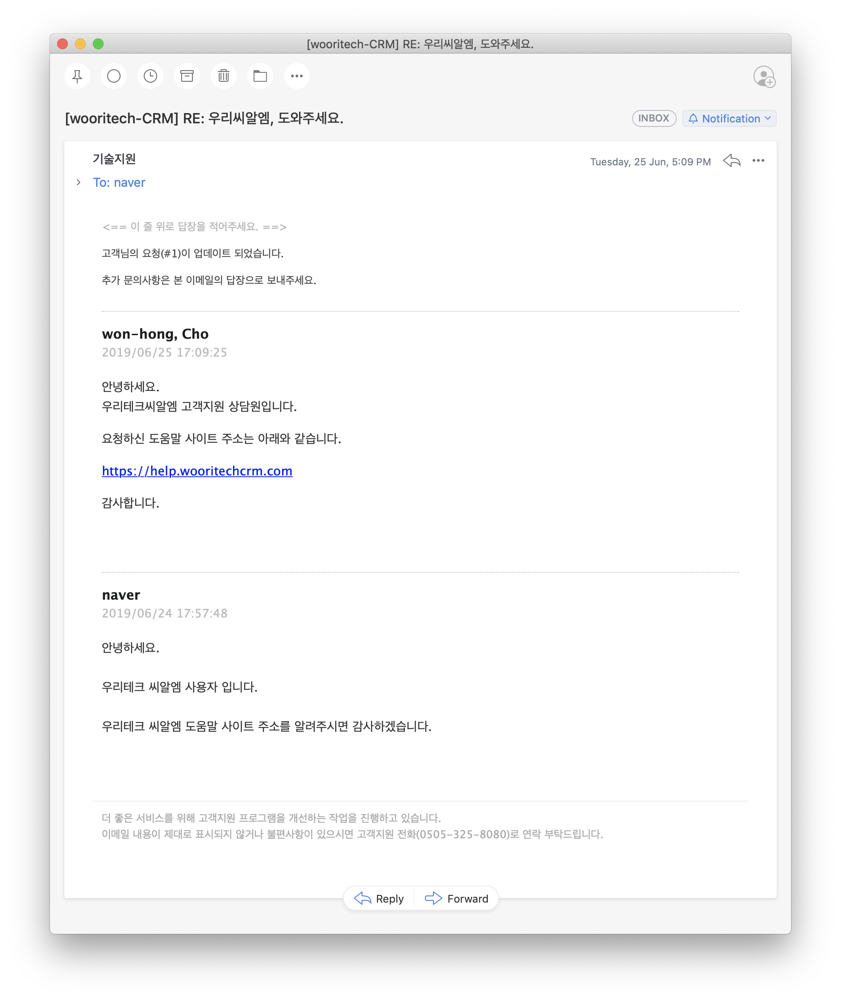

## 8. 고객의 추가 요청 테스트

일반적으로 고객의 요청은 한 번에 모든 문제를 해결하기 힘든 경우가 많습니다. 따라서 고객은 해당 요청에 대한 추가 질문을 하고 싶을 수 있습니다. 이때 고객이 상담원의 답변메일에 답장을 보내도록 안내할 필요가 있습니다. 물론 새로운 메일로 요청을 보낼 수도 있지만 그렇게할 경우 RealDesk는 *새로운 티켓을 생성*하게 됩니다.

기존의 요청 티켓을 유지하면서 추가 요청이 필요한 경우 아래 화면처럼 **상담원 답변 메일에 답장(Reply)** 을 작성 합니다.

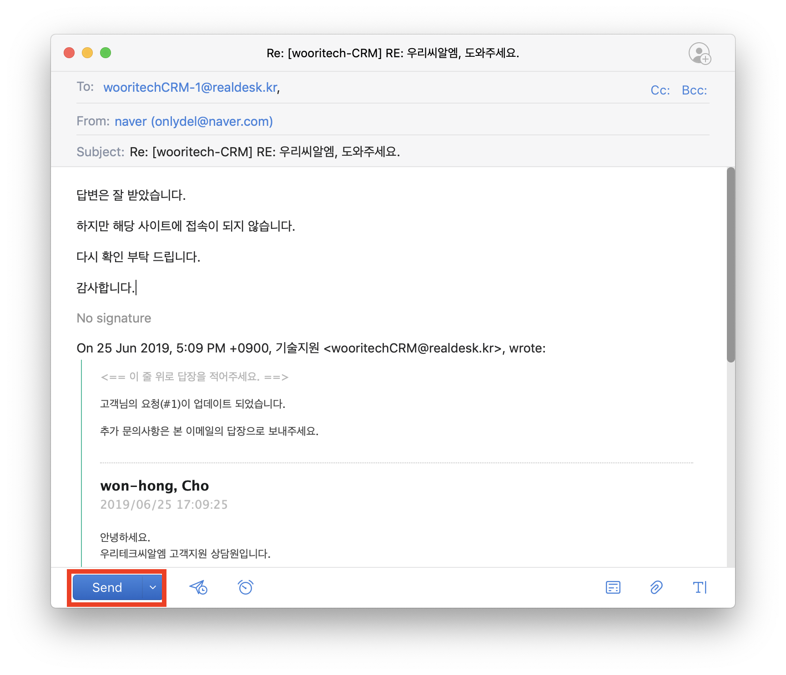

## 9. 상태가 다시 변경된 티켓 확인

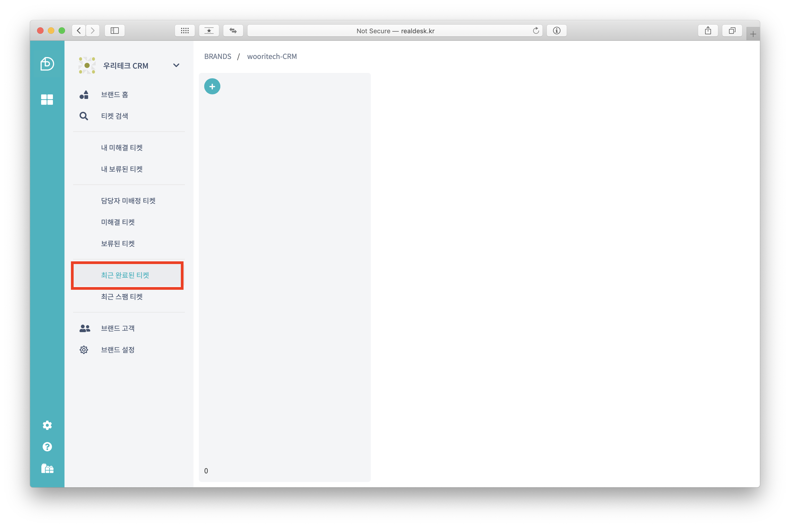

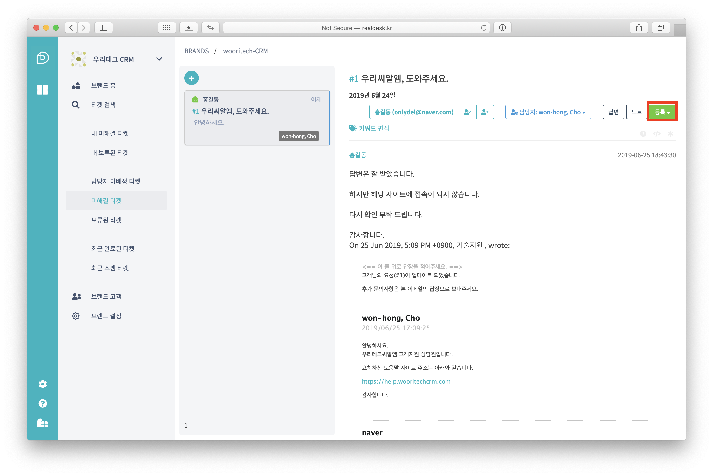